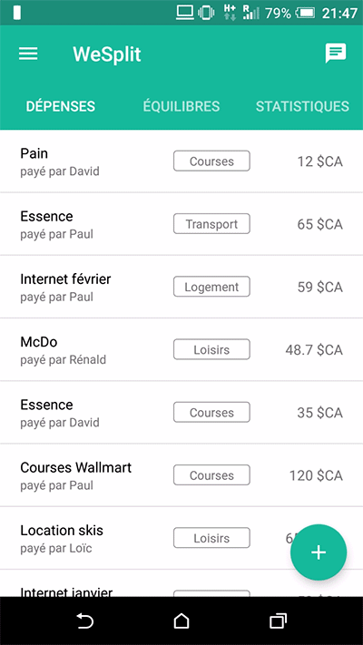
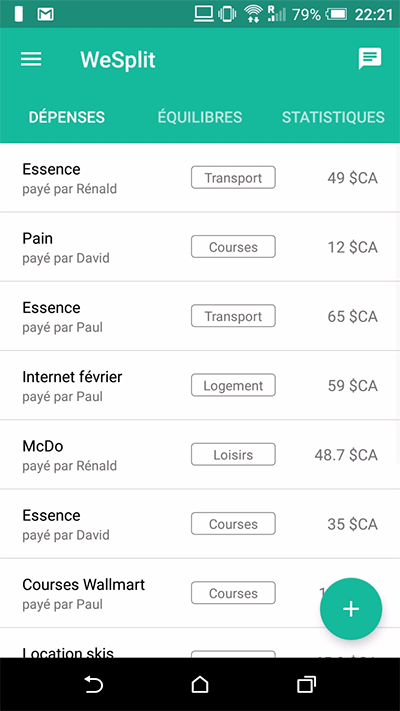
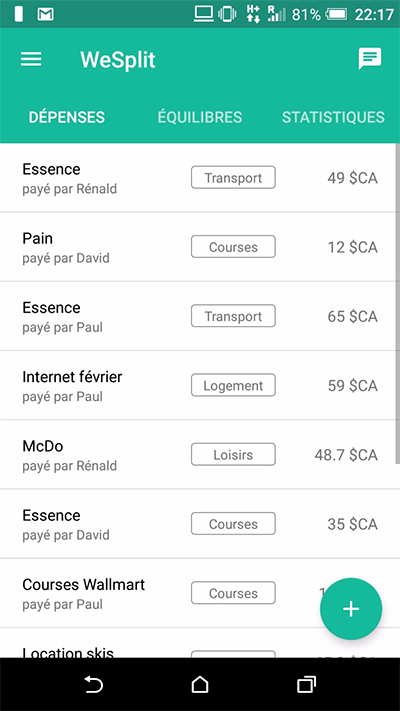
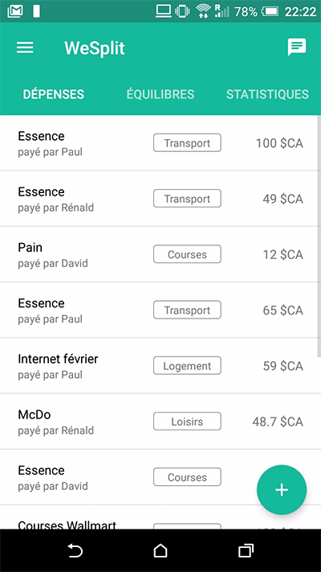

# we-split

<h2>8INF957 Programmation objet avancée - Hivers 2018 - UQAC</h2>
<h3>Projet WeSplit - David Delemotte, Paul Michaud</h3>

<h4>Présentation</h4>

WeSplit est une application Android de gestion des dépenses collaboratives. Elle permet à un groupe de personnes ayant crée un compte de gérer leurs dépenses communes et de faire diverses actions liées à celles-ci. Le mini-srs est à la racine du Github (<i>Mini-SRS.pdf</i>). Le code Java se trouve dans <i>app/src/main/java/com/uqac/wesplit</i>.

<h4>APK</h4>

L'APK du projet, pouvant être mis sur un téléphone Android (Ice Cream Sandwich min) peut être téléchargée <a href="https://drive.google.com/drive/folders/1opOghcg1jxhMmqb_k6_wJcIFniN_6Stm?usp=sharing" target="_blank">sur ce Google Drive</a>.
Pour l'installer, suivre <a href="http://www.frandroid.com/comment-faire/tutoriaux/trucs-et-astuces/184151_comment-installer-un-fichier-apk-sur-son-terminal-android" target="_blank">ce tutoriel de frandroid</a>. 

<h4>Configuration et compilation du projet</h4>

Il est nécessaire d'avoir Android Studio. Il faut également un fichier <i>google-services.json</i> à la racine, contenant les identifiants du compte Firebase associé au projet. Il contient des mot de passes/identifiants, nous ne pouvons donc pas le rendre public (nous pouvons vous l'envoyer par mail si nécessaire). <b>Le projet ne compilera pas sans ce fichier.</b>

<h4>Gifs de l'interface</h4>

  
  ____
  

 

  
  ____
  

<h4>Toutes les fonctionnalités</h4>

- Inscription, connexion, déconnexion, mot de passe oublié
- Rejoindre un groupe existant ou créer un nouveau groupe pour partager les dépenses

- Affichage de la liste des dépenses
- Ajout/Modification/Suppression/Affichage d'une dépense
- Affichage des équilibres entre les personnes
- Affichage de statistiques et choix de la période d'affichage
- Zone de discussion entre les membres du groupe

- Modification des membres du groupe, suppression du groupe
- Modification du mot de passe et de l'adresse email
# depense_A
